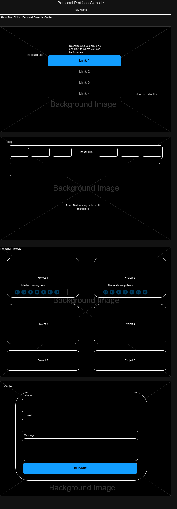

# Eugene Boondock's Personal Website

## Project Overview

The project aims to serve as a comprehensive portfolio and representation of my skills, experiences, and projects in the fields of AI, web development, and software engineering. It serves as a platform to showcase my capabilities and interests, providing visitors with insights into my technical expertise and professional journey. The website is designed to not only highlight my technical skills but also reflect my creative approach to problem-solving and my commitment to innovation in the technology space.

## Features and Functionality

- **Interactive Navigation:** Users can easily navigate through various sections of the website using the interactive navigation menu.
- **Project Showcase:** The website prominently displays a collection of my notable projects, each with a brief description and a link to the corresponding source code.
- **Contact Form:** The contact section includes a form through which users can reach out to me directly for inquiries, collaborations, or any other discussions.
- **Dynamic Visuals:** The website incorporates dynamic visuals, including videos and images, to create an engaging and immersive user experience.
-**Detailed Sections:** 'About Me,' 'Skills,' 'Personal Projects,' and 'Contact' allow users to explore my background, technical skills, and past projects.

## Technologies Used

The project is primarily built using the following technologies and tools:

- **HTML & CSS**: Used for structuring and styling the website's layout and design.
- **JavaScript**: Implemented to add dynamic and interactive elements to the web pages.
- **Git & GitHub**: Employed for version control and collaborative development.
-**PHP**: Utilized for server-side to allow for me to receive emails
- **Drawio**: Used for design inspiration and prototyping of various web elements.

## WorkFlow and Mockup

## Roadmap and Future Enhancements
- Will deploy to Github Pages
- Add more projects and refine it as I learn more and more
- Add links to live demos of my projects

## Contact Information

For any inquiries, collaborations, or discussions, please feel free to reach out to me:

- **Eugene Boondock**
- [GitHub](https://github.com/EugeneBoondock/alx_capstone_project)
- [LinkedIn](https://www.linkedin.com/in/eboondock/)
- [Twitter](https://twitter.com/MansaKirito)
- [Personal Portfolio](https://eugeneboondock.github.io/alx_capstone_project)
- [Email](philosncube@gmail.com)
